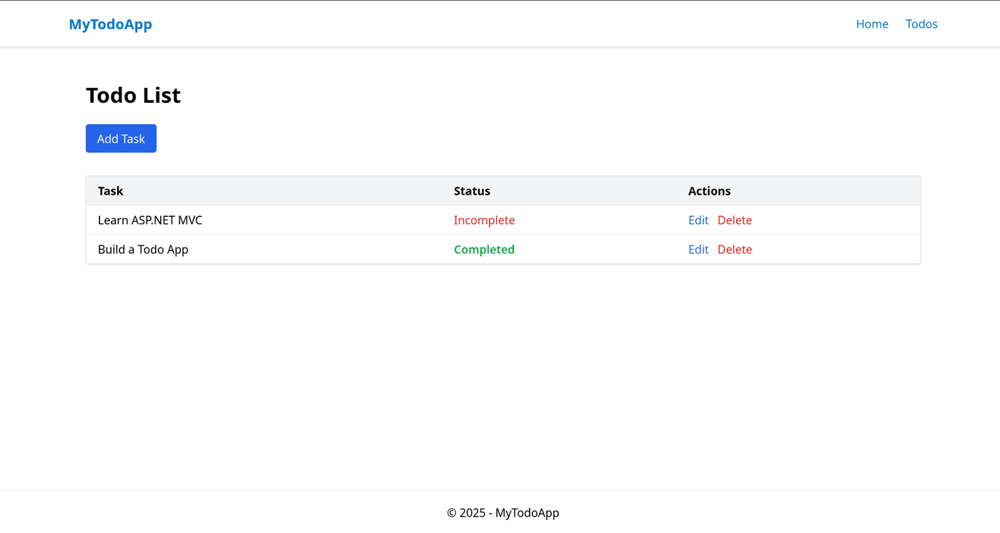

# 📝 MyTodoApp

A simple Todo List application built with **ASP.NET MVC** (no database) using **Tailwind CSS** for styling.  
Tasks are stored in memory using a static list and reset each time the application restarts.

---

> ⚠️ **Disclaimer**  
> This project is intended **for teaching purposes only**. It serves as a basic introduction to the **MVC (Model-View-Controller)** pattern using **ASP.NET Core MVC**, aimed at helping students understand the structure and flow of MVC applications.  
> It does **not use a database** and stores data in memory, which means all data is lost when the application stops.


## 🚀 Features

- ✅ Add new todo items
- ✅ Mark tasks as complete/incomplete
- ✅ Edit existing tasks
- ✅ Delete tasks
- ✅ Client + server-side validation (no empty tasks)
- ✅ UI using Tailwind CSS CDN
- ✅ Dynamic views with ViewBag and ViewData examples

---

## 🖼️ Screenshot



---

## 🛠️ Tech Stack

- ASP.NET Core MVC
- Tailwind CSS (CDN)
- C#
- Razor Views

---

## Getting Started

### Prerequisites

- .NET SDK installed (e.g., [.NET 6+](https://dotnet.microsoft.com/download))

### Run the App

```bash
dotnet run
```

